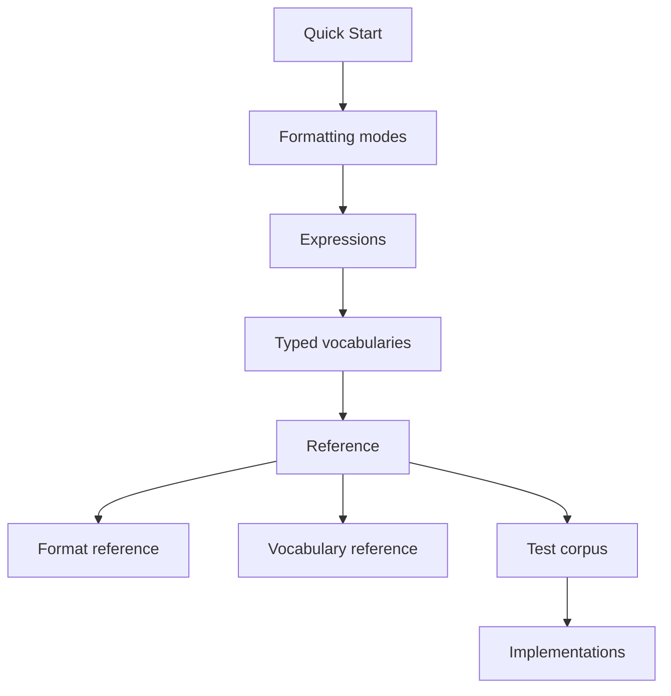

# RON

RON means Readable Object Notation.

This repository is the language-neutral reference for the RON format. RON keeps the JSON data model while making large JSON-shaped documents easier to write, easier to read, and cheaper in LLM tokens. It contains the format decision record, an implementation guide, and conformance fixtures for RON -> JSON and JSON -> RON conversion, including pretty-format golden files.

This RON is not [Rusty Object Notation](https://github.com/ron-rs/ron).

RON borrows the readability goal of data-first expression syntaxes while keeping the JSON value model as the contract. See [Expressions and related formats](#expressions-and-related-formats) for comparisons with EDN and other adjacent syntaxes.

## Documentation map

Use this order:

- Orientation
    - [Quick Start](#quick-start): read this before running conformance commands; compare RON with equivalent JSON.
- Concepts
    - [Formatting modes](#formatting-modes): pretty, compact, canonical, and source-order output.
    - [Expressions and related formats](#expressions-and-related-formats): the JSON-shaped expression model, plus EDN/Clojure, JSON5, and YAML comparisons.
    - [Typed vocabularies](#typed-vocabularies): optional semantic tags such as `#utc`, `#url`, `#vN`, and `#geo`.
- Reference
    - Format
        - [`docs/ADR.md`](docs/ADR.md): normative syntax details.
            - Values, tokens, whitespace, numbers, and strings.
            - Objects, arrays, top-level object elision, and formatting.
            - Corpus decisions, alternatives, and consequences.
        - [`docs/implementation-guide.md`](docs/implementation-guide.md): parser, renderer, formatter, and implementation order guidance.
    - Typed values
        - [`docs/vocabularies.md`](docs/vocabularies.md): official vocabulary registry, profile model, payload rules, and custom vocabulary contract.
        - [`schemas/vocabularies/`](schemas/vocabularies/): JSON Schema Draft 2020-12 validation and codegen aids.
    - Test corpus
        - [Conformance](#conformance): fixture runner requirements.
        - [`testdata/conformance/`](testdata/conformance/): RON fixture corpus.
        - [`testdata/rfc8785/`](testdata/rfc8785/): RFC 8785 canonical JSON fixture corpus.
        - [`testdata/vocabularies/`](testdata/vocabularies/): typed vocabulary fixtures.
- Ecosystem
    - [Implementations](#implementations): current library support matrix.



## Quick Start

Start here before running the conformance commands. This example shows top-level object elision, nested objects, arrays, booleans, null, numbers, bare strings, quoted strings, quoted keys, optional commas, comma-prefixed tokens, and punctuation-like strings.

```ron
active true
age 37
commaPrefixed [,foo]
commaToken [, x]
commas {
  a 1,
  b 2,
}
emptyArray []
emptyObject {}
id ?id
metadata {
  count 9223372036854775808
  nullValue null
  score -12.5e+2
}
name Ada
quoted {
  double ""a "quoted" phrase""
  empty ''
  single 'Ada Lovelace'
  withApostrophe ''it's fine''
}
'quoted key' 'quoted value'
ref {# 200}
roles [admin writer]
strings [hello 'true' '123' '#_tmp']
temp #_tmp
```

```json
{
  "active": true,
  "age": 37,
  "commaPrefixed": [
    ",foo"
  ],
  "commaToken": [
    ",",
    "x"
  ],
  "commas": {
    "a": 1,
    "b": 2
  },
  "emptyArray": [],
  "emptyObject": {},
  "id": "?id",
  "metadata": {
    "count": 9223372036854775808,
    "nullValue": null,
    "score": -12.5e+2
  },
  "name": "Ada",
  "quoted": {
    "double": "a \"quoted\" phrase",
    "empty": "",
    "single": "Ada Lovelace",
    "withApostrophe": "it's fine"
  },
  "quoted key": "quoted value",
  "ref": {
    "#": 200
  },
  "roles": [
    "admin",
    "writer"
  ],
  "strings": [
    "hello",
    "true",
    "123",
    "#_tmp"
  ],
  "temp": "#_tmp"
}
```

## Formatting modes

RON formatting has independent options. Use flags, option structs, variadic options, or idiomatic equivalents for the target language:

- `isPretty`: render multiline pretty output when true, compact output when false.
- `isCanonical`: sort object keys in RFC 8785 UTF-16 code unit order for stable byte-for-byte output when true; preserve source object member order when false and the parser has it.

Compact is not automatically canonical. Canonical RON is compact RON rendered with `isPretty=false` and `isCanonical=true`. Use canonical mode when stable bytes or hashes matter. It has extra cost because each object may need key sorting; non-canonical compact output can preserve source order and avoid that sort.

Canonical JSON means RFC 8785 JSON Canonicalization Scheme (JCS) bytes encoded as UTF-8. Its fixtures live under `testdata/rfc8785/`.

Canonical hashes use SHA-256, encoded as 64 lowercase hexadecimal digits. RON conformance cases hash exact canonical RON bytes in `expectedCanonicalRONSHA256`. RFC 8785 cases hash exact canonical JSON bytes in `expectedCanonicalJSONSHA256`. Testdata declares `expectedPrettyOptions` as `isPretty=true, isCanonical=true` and `expectedCompactOptions` as `isPretty=false, isCanonical=true`.

Pretty JSON-to-RON rendering emits root JSON object members at top level by default. JSON-to-RON renderers should also expose typed value hooks for application-specific examples. Hooks map JSON values by path to replacement JSON values before RON formatting, so a string at `tx` can render as `{# BE}` by replacing it with `{"#":"BE"}`.

## Expressions and related formats

A RON expression is a JSON value written with lighter syntax: scalars, arrays, objects, top-level object members, and single-key tagged typed values. The model stays JSON-shaped so exact RON <-> JSON conversion remains the contract.

RON is not EDN or Clojure data notation. EDN helped prove that data-first expressions can be pleasant to author, but its native value model is wider than JSON and not a lowest-common-denominator interchange format across languages. RON keeps the readability goal and subtracts the non-JSON value space.

JSON5 and YAML solve adjacent authoring problems, but RON intentionally keeps a smaller JSON-compatible surface. See [`docs/ADR.md`](docs/ADR.md) for the full alternatives analysis.

## Typed vocabularies

Typed vocabularies are optional semantic layers over JSON-compatible single-key objects. Official vocabularies define readable tags such as `#utc`, `#dur`, `#url`, `#uid`, `#dec`, `#vN`, `#f3v`, `#lla`, and `#geo`; custom vocabularies use namespaced tags such as `#com.example/money`. Base RON parsers preserve all of these as ordinary JSON objects.

## Implementations

| Implementation | Language | Base RON | RFC 8785 canonical JSON |
| --- | --- | --- | --- |
| [starfederation/ron-go](https://github.com/starfederation/ron-go) | Go | Yes | Yes |

### Typed vocabulary support

| Implementation | Core | Time | Network | Math | Spatial | Geo | Color | Custom |
| --- | --- | --- | --- | --- | --- | --- | --- | --- |
| [starfederation/ron-go](https://github.com/starfederation/ron-go) | :white_check_mark: | :white_check_mark: | :white_check_mark: | :white_check_mark: | :white_check_mark: | :white_check_mark: | :white_check_mark: | :white_check_mark: |

When adding an implementation, list each supported vocabulary URI or short name from `docs/vocabularies.md`, for example `core`, `time`, `math`, or `geo`. Use `:white_check_mark:` for supported vocabularies.

## Conformance

Use `testdata/conformance/manifest.json` as the test runner input. For each valid case:

1. Convert every `ronInputs[]` file to JSON.
2. Compare compact output with `expectedCompactJSON` if compact mode is supported.
3. Compare pretty output with canonical order against `expectedPrettyJSON` if pretty mode is supported.
4. Convert `jsonInput` to RON.
5. Compare pretty canonical RON with `expectedPrettyRON`.
6. Compare compact canonical RON with `expectedCompactRON` if compact mode is supported.
7. Hash compact canonical RON with SHA-256 and compare lowercase hex with `expectedCanonicalRONSHA256`.
8. Parse generated RON back to JSON and compare JSON values, not text.
9. Run `jsonToRONRendering` cases for root object elision and typed value hooks when those hooks are supported.

For invalid cases, every `invalidRON[]` file must fail RON parsing and every `invalidJSON[]` file must fail JSON -> RON conversion.

Use `testdata/rfc8785/manifest.json` for RFC 8785 canonical JSON vectors. Implementations must exact-match canonical JSON bytes, expected UTF-8 hex when present, Appendix B number serialization samples, I-JSON rejection cases, and SHA-256 hashes.

Use `testdata/vocabularies/manifest.json` for typed vocabulary fixtures. Vocabulary-aware implementations should validate and map enabled typed tags; base implementations may treat the same files as ordinary JSON/RON round-trip cases.
